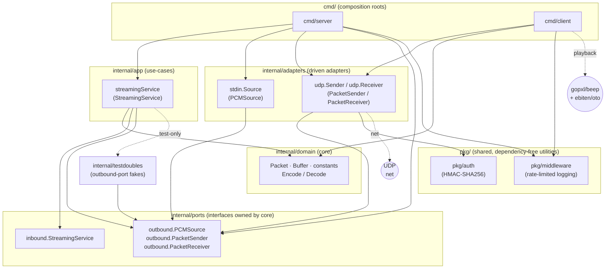

# SoundByte architecture

Detailed reference for how SoundByte is built today. For the short historical
overview see [`docs/architecture/2026-05-02-overview.md`](architecture/2026-05-02-overview.md);
this document is the deep version and the home of the ports & adapters map and
the boundary-guard contract enforced by [`.go-arch-lint.yml`](../.go-arch-lint.yml).

## Purpose & context

SoundByte is a self-hosted, low-latency audio streaming system for the LAN. It
moves **raw PCM audio over UDP** with the thinnest possible protocol:

- A **server** (sender) reads a raw PCM byte stream from **stdin or a named
  file/pipe**, splits it into fixed 5 ms frames, wraps each frame in a 12-byte
  header, optionally signs it, and blasts the datagrams to a target UDP address.
  The server is headless — it never opens an audio device.
- A **client** (receiver) listens on a UDP port, verifies each datagram,
  decodes it, feeds it into a **jitter buffer** that reorders by sequence
  number, and plays the reassembled PCM through the host sound device via
  [`gopxl/beep`](https://github.com/gopxl/beep).

The canonical source is **Spotify Connect through
[`librespot`](https://github.com/librespot-org/librespot)**, whose PCM output is
piped into the server's stdin; any Linux program that emits S16LE PCM on a pipe
works equally well. SoundByte is the simple, pipe-based cousin of Snapcast for
the homelab; the latency budget is small (well under ~50 ms) because playback is
meant to track the source in near-real-time.

**Audio format is fixed:** S16LE, stereo, 48 kHz. One frame is 5 ms =
`48000 × 2ch × 2bytes × 0.005s` = **960 bytes** of PCM
(`domain.FrameSizeBytes`). Packets stay under a 1400-byte cap
(`domain.MaxPacketSize`) to avoid IP fragmentation.

## Hexagonal shape (ports & adapters)

SoundByte follows the hexagonal / ports-and-adapters style. The dependency rule
points **inward**:

```
adapters ──▶ app ──▶ domain
   │          │
   └──────────┴──▶ ports (interfaces owned by the core)
```

- **domain** depends on nothing internal (stdlib only).
- **ports** are Go interfaces owned by the core; concrete I/O lives in adapters.
- **app** (use-cases) depends on domain + ports, never on adapters.
- **adapters** implement ports and depend on domain + ports (udp also uses
  `pkg/auth`).
- **cmd/** are the composition roots — the only place allowed to wire everything
  together.

### Component / dependency diagram



### Ports & adapters map

| Layer | Package | Key Go symbols | Depends on (internal) |
|---|---|---|---|
| **Domain (core)** | `internal/domain` | `Packet` (`Encode`/`Decode`), `Buffer` (jitter, `Push`/`Pop`/`Len`), constants `HeaderSize`, `MaxPacketSize`, `SampleRate`, `Channels`, `FrameSizeMs`, `FrameSizeBytes`, `ErrPacketTooShort` | *(nothing)* |
| **Inbound port** (driving) | `internal/ports/inbound` | `StreamingService` interface — `Stream(ctx) error` | *(nothing)* |
| **Outbound ports** (driven) | `internal/ports/outbound` | `PCMSource` — `ReadFrame([]byte) error`; `PacketSender` — `Send([]byte) (int, error)`; `PacketReceiver` — `Receive() ([]byte, string, error)` | *(nothing)* |
| **Application** | `internal/app` | `streamingService` implements `inbound.StreamingService`; `NewStreamingService(PCMSource, PacketSender)` | `domain`, `ports/inbound`, `ports/outbound` |
| **Inbound/driven adapter** | `internal/adapters/stdin` | `Source` implements `outbound.PCMSource`; `NewSource()`, `NewFileSource(path)` | `ports/outbound` |
| **Driven adapter** | `internal/adapters/udp` | `Sender` implements `outbound.PacketSender`; `Receiver` implements `outbound.PacketReceiver` | `ports/outbound`, `pkg/auth` |
| **Test support** | `internal/testdoubles` | `FakePCMSource`, `FakePacketSender`, `FakePacketReceiver`, `ServerDeps` | `ports/outbound` |
| **Composition root (server)** | `cmd/server` | `main`, `loggingPacketSender` | `domain`*, `ports/outbound`, `app`, `adapters/stdin`, `adapters/udp`, `pkg/middleware` |
| **Composition root (client)** | `cmd/client` | `main`, `PCMStreamer`, `receiveLoop` | `domain`, `adapters/udp`, `pkg/middleware` |
| **Shared utility** | `pkg/auth` | `Sign`, `Verify`, `MACSize`, `ErrInvalidMAC` | *(nothing)* |
| **Shared utility** | `pkg/middleware` | `Logger`, `New(direction)`, `Log(bytes, addr)` | *(nothing)* |

\* `cmd/server` is permitted domain/ports access as a composition root; its
current code imports `ports/outbound` (for the `loggingPacketSender` decorator),
`app`, both adapters, and `pkg/middleware`.

The interfaces in `ports/inbound` and `ports/outbound` **are** the ports — they
are owned by the core, and adapters/app implement or consume them. This is what
lets `internal/testdoubles` supply in-memory fakes so `app` can be unit-tested
with no sockets or files.

### Server vs. client asymmetry (known deviation)

The **server half is fully layered**: `cmd/server` builds a `stdin.Source` and a
`udp.Sender`, wraps the sender in a logging decorator, and injects both into
`app.NewStreamingService`, driving it through the `inbound.StreamingService`
port. The domain never touches I/O.

The **client half is deliberately *not* routed through `app`**. `cmd/client`
wires a `udp.Receiver` (an outbound port) directly to a `domain.Buffer` and to a
`PCMStreamer` (a `beep.Streamer`), and the receive loop lives in
`cmd/client/main.go`. There is no client-side application service or inbound
port. This is an accepted deviation, not an accident: the client's job is a thin
receive-decode-buffer-play loop with no business logic worth extracting, and
pulling `gopxl/beep` behind a port would add indirection without payback. The
boundary guard therefore scopes `cmd/client`'s allowed dependencies to
`domain`, `adapters/udp`, and `pkg/middleware` rather than requiring an app
layer. If client-side logic grows (e.g. resampling, multi-stream mixing), the
right move is to introduce a client application service behind an inbound port
and tighten the rule.

## Data / request flow (end to end)

```
librespot / pipe  ──stdin──▶  stdin.Source.ReadFrame (960B)
                                      │
                     app.streamingService.Stream(ctx)
                                      │  build domain.Packet{seq, ts, pcm}
                                      │  Packet.Encode()  → 12B header + PCM
                                      ▼
                     loggingPacketSender.Send → udp.Sender.Send
                                      │  auth.Sign (optional 32B HMAC)
                                      ▼
                              UDP datagram ──▶ network
                                      ▼
                     udp.Receiver.Receive  (auth.Verify, strip HMAC)
                                      │
                              domain.Decode → *Packet
                                      ▼
                        domain.Buffer.Push (reorder by Sequence)
                                      ⋮  (holds until ≥ minCount packets)
                        domain.Buffer.Pop  ◀── PCMStreamer.Stream
                                      │  S16LE bytes → [2]float64 samples
                                      ▼
                        gopxl/beep speaker → host audio device
```

1. **Source read.** `app.streamingService.Stream` loops: `source.ReadFrame(pcm)`
   fills a 960-byte buffer via `io.ReadFull`. `io.EOF` ends the stream cleanly;
   `ctx` cancellation aborts it.
2. **Packetize.** Each frame becomes a `domain.Packet` with a monotonic
   `Sequence` and a nanosecond `Timestamp`, then `Encode()` produces
   `[4B seq big-endian][8B ts big-endian][PCM]`.
3. **Send.** `udp.Sender.Send` calls `auth.Sign` (appends a 32-byte HMAC-SHA256
   tag when a token is set; no-op otherwise) and writes the datagram. Encode or
   send errors are skipped rather than fatal — a dropped frame is better than a
   stalled stream.
4. **Receive & verify.** `udp.Receiver.Receive` reads one datagram, runs
   `auth.Verify` (strips/validates the HMAC), and returns the payload plus the
   sender address. Unauthenticated or malformed datagrams are dropped silently
   in the client's `receiveLoop`. A 500 ms read deadline lets the loop honour
   context cancellation between blocking reads.
5. **Decode & buffer.** `domain.Decode` rebuilds the `Packet`; `Buffer.Push`
   inserts it and keeps the slice sorted by `Sequence`.
6. **Playback.** `Buffer.Pop` returns packets only once at least `minCount`
   (default 20 packets ≈ 100 ms) have accumulated, absorbing jitter and
   reordering. `PCMStreamer.Stream` converts S16LE bytes to beep's
   `[2]float64` samples (`/ 32768.0`) and the `speaker` renders them.

### Protocol summary

| Field | Size | Notes |
|---|---|---|
| Sequence | 4 B, big-endian | monotonic ordering key |
| Timestamp | 8 B, big-endian | creation time, ns |
| PCM payload | up to `MaxPacketSize − HeaderSize` | S16LE stereo 48 kHz, typically one 960 B frame |
| HMAC (optional) | 32 B, appended | present only when `-token` is set on both ends |

Adding header fields breaks wire compatibility on both halves — this is called
out as an invariant in `AGENTS.md`.

## External integrations

- **`librespot` (Spotify Connect)** — primary PCM source; its output pipes into
  the server's stdin. Optional and out-of-process; SoundByte has no code
  dependency on it.
- **`gopxl/beep` v2** (with `ebitengine/oto` v3) — client-side playback. On
  Linux this needs ALSA (`libasound2` / `alsa-lib`), which is why the client
  build requires CGO. Only the client links it.
- **UDP networking** (`net`) — the transport. The server `DialUDP`s a target
  address (default `255.255.255.255:5004`, i.e. broadcast); the client
  `ListenUDP`s on a port and bumps the socket read buffer to 1 MiB.

## Key decisions

- **Raw PCM over UDP, no codec, no ACKs.** Lowest possible latency for a LAN;
  loss is tolerated because a jitter buffer + monotonic sequence numbers handle
  reordering and small gaps. No retransmission.
- **Fixed 5 ms / 960 B framing.** Small, uniform frames keep latency low and the
  decode path branchless; the trade-off is packet-rate overhead (~200 pkts/s).
- **Ports & adapters** so the core (packetization, jitter buffer) is testable
  with fakes and the I/O edges (stdin/file, UDP) are swappable.
- **Optional HMAC-SHA256, opt-in via `-token`.** Zero-cost when disabled (auth
  functions are no-ops on a nil key); when enabled it authenticates every
  datagram and lets the client drop spoofed traffic.
- **Rate-limited aggregate logging** (`pkg/middleware`) emits one line every 5 s
  instead of per-packet, avoiding stdout flooding at 200 pkts/s.
- **Client stays un-layered on purpose** — see the asymmetry note above.

## Deployment

SoundByte builds **two** container images and is **not** currently deployed in
the homelab (there is no Flux/homelab pin path for it):

| Image | Dockerfile | Platforms | Notes |
|---|---|---|---|
| `ghcr.io/gjcourt/soundbyte` | `Dockerfile` | `linux/amd64,linux/arm64` | Server. Pure Go, `CGO_ENABLED=0`, cross-compiled. Entrypoint `soundbyte-server`. |
| `ghcr.io/gjcourt/soundbyte-client` | `Dockerfile.client` | `linux/amd64` only | Client. Needs CGO + ALSA (`alsa-lib`) for playback, so it cannot cross-build for arm64. Entrypoint `soundbyte-client`. |

- **CI/build:** `.github/workflows/image.yml` builds and pushes both images to
  GHCR on every push to `main` (plus manual `workflow_dispatch`), authenticating
  with the built-in `GITHUB_TOKEN`. Each build publishes three tags per image:
  mutable `YYYY-MM-DD`, immutable `YYYY-MM-DD-<sha7>` (the one to pin), and
  `latest`. See `AGENTS.md` → *Container images* for the tag/mutability contract
  and the first-build GHCR gotcha.
- **Local run:** `docker-compose.yml` builds both images and runs `server` and
  `client` side by side (server on `client:5004`, stdin open for piping). Note
  its own caveat: the containerized client only reaches host audio on Linux via
  `/dev/snd`; on macOS/Windows run the client natively with `go run ./cmd/client`.
- **Binaries:** `make build` produces `./server` and `./client` (git-ignored,
  never committed).

## Boundary guard

The inward dependency rule above is enforced in CI by
[go-arch-lint](https://github.com/fe3dback/go-arch-lint) v1.16.0 via
[`.go-arch-lint.yml`](../.go-arch-lint.yml) (config `version: 3`). Every Go
package maps to exactly one component; `allow.depOnAnyVendor: true` permits
external libraries. The experimental `deepScan` value-flow tracer is turned
**off** on purpose: it reports the composition roots (`cmd/server`,
`cmd/client`) as depending on every type they wire together, which is precisely
what a composition root does — the import-level check is the canonical
hexagonal boundary guard.

Run it locally:

```bash
go install github.com/fe3dback/go-arch-lint@v1.16.0
go-arch-lint check
```

CI runs the same check on every PR — see `.github/workflows/ci.yml`
(`arch-lint` job).
